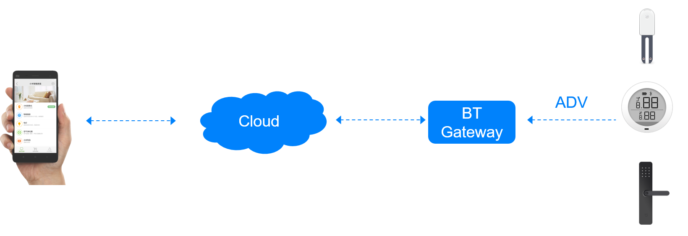
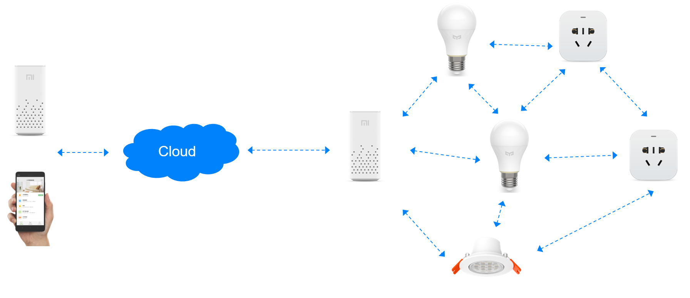

# BLE接入介绍

根据产品的安全等级、是否支持Mesh等特性，平台提供三种不同的接入方式：

* 标准BLE接入
* 高安全级BLE接入
* BLE Mesh接入

这三种接入方式各有特点，平台会提供相应的固件端软硬件支持，完成设备的认证，帮助产品接入到米家APP中。

对于普通安全级别的产品，如温湿度传感器，可采用标准BLE方式接入，无须提前烧写预置安全秘钥或增加安全芯片，开发更便捷。

对于高安全级别的产品，如蓝牙智能门锁，可采用高安全级BLE方式接入，必须搭配安全芯片使用，同时配合pin code OOB认证。

BLE Mesh接入是较新的技术，更多介绍请参考下文。

 

###  强绑定和弱绑定 ###

------

#### 强绑定： #### 
​设备绑定账号后，其他人绑定时会提示设备已经被别人绑定。即我不删除，谁都绑不走。
#### 弱绑定：
​设备绑定账号后，其他人绑定时，会绑定成功，原账号刷新列表，设备消失。即谁最后绑定就是谁的。

​**至于如何选择强弱绑定关系，各家接入厂商可以根据自家的产品特点，自行选择合适的绑定方式**。

## 标准BLE接入

通过标准BLE方式接入后，设备将获得如下能力：
- 设备获得由米家服务器分配的唯一Device ID，并绑定在登陆米家APP的账号下。
- 设备可以与米家App建立GATT连接，传递数据。
- 设备可以发送包含事件或属性信息的MiBeacon。米家所有BLE网关都可以接收MiBeacon并转发给米家服务器。后续可以根据存储在米家服务器的事件或属性信息在APP上显示或进行自动化配置。如何使用MiBeacon广播事件或属性请参考米家BLE MiBeacon协议并**严格遵守注意事项**。
- 设备可以在同一小米账号下的多个手机上使用。
- 设备可以被安全分享至另外的小米账号。
- 设备可以通过米家APP进行OTA。

GATT数据拓扑

MiBeacon数据拓扑

 

## 高安全级BLE接入

此类接入可以提供更高的安全等级：
- 必须使用米家安全芯片，安全芯片可以保证设备是小米认证过的设备。
- 每次绑定都会生成一个新的长期密钥(根密钥)，每次连接都会生成一个新的会话密钥。
- 高安全级接入可以应对重放攻击、窃听攻击、中间人攻击、垃圾桶攻击、暴力破解等一系列攻击手段，最大程度保证设备安全。
- 高安全级接入设备也可以通过GATT和MiBeacon方式传递数据。

 

## BLE Mesh接入

### 小米BLE Mesh接入特性介绍

- 智能音箱/网关是整个BLE Mesh系统的核心，控制消息都是音箱/网关发出的，暂时不支持Mesh子设备之间互相交互。推荐通过小爱同学语音来完成设备控制。目前支持的智能音箱/网关产品有：小米小爱智能闹钟、Yeelight智能语音助手、2019年5月份之后上市的全系小爱智能音箱。
- 与传统BLE接入相比，BLE Mesh接入可以提供消息下行功能，即网关发出消息到设备。
- BLE Mesh具有更高级别的安全性。
- BLE Mesh会使得所有的子设备组成一个网络，经过合理的布局和Mesh提供的转发功能，更多的设备可接入网络，也可突破传统BLE接入距离的限制。
- BLE Mesh接入与传统BLE接入暂不兼容，只能选择一种。
- 支持低功耗。

BLE Mesh数据拓扑

### 小米BLE Mesh模组介绍

- 默认支持Relay，Friend，Low Power功能，Proxy功能可选。
- 默认支持Generic OnOff Server Model, Generic Level Server Model, CTL Server Model, Lightness Server Model，Sensor Server Model，Vendor Server Model。推荐使用SIG标准Model。Level Model，CTL Model，Lightness Model都支持Transition & Delay。Vendor Model需要在开放平台配置，可以进行数据透传，传输的有效数据最多为4 Bytes (int32)。
- 某些场景下需要Server端主动上报数据，Client端收到数据后必须回复，让Server端确认Client已经收到了数据。因此特别在Vendor Model中定义Indication和Indication Ack。此功能适合某些低功耗传感器类设备，只有数据上行。当需要发送数据时，设备从低功耗状态进入到正常状态并定时重复发送数据，当收到网关回复消息或定时器超时，会停止发送，并从正常状态进入到低功耗状态。
- 默认支持使用米家App进行分组，支持按组控制。
- 默认使用小米私有Provision方式进行入网，此方式保证了Mesh系统的安全性同时支持多网关漫游功能。智能音箱/网关和米家App都可以操作设备入网。
- 使用MIoT Spec定义设备描述和功能定义规范，此时产品可以被小爱同学直接语音控制。
- 不建议用户修改模组里面关于Mesh的参数。这些参数已经经过米家团队的优化。
- BLE Mesh消息从网关到设备所需的平均时间大约为100ms。如果设备距离网关较远，需要多次转发，所需的时间还可能变长。
- 目前只支持GATT OTA功能。
- 用户慎重在需要消息下行时启用Low Power功能。在需要消息下行时，Low Power功能必须与Friend功能配合使用。启动Low Power功能可能会造成数据下行延时。启用此功能需首先与小米产品经理进行对接。

### 小米BLE Mesh模组提供的API介绍

*通用介绍，不同平台具体定义可能会略有不同*

- 用户可以创建SIG Mesh Server Model或Vendor Server Model。
- 对于每一个Server Model：
  - 用户可以接收到Get/Set/Set Unacknowledged消息，并可以在回调中运行自己的操作。例如操作GPIO/PWM来开关灯。
  - 用户可以调用Status Ack接口来回复Set消息。
  - 用户可以根据Status变化来Publish消息。
  - 用户可以设置周期性的Publish。
- 提供重置模组的接口(类似于收到reset的操作)。用户需要自定义调用重置接口的方式，例如快速开关5次或者长按按键等。
- 提供触发Indication的接口。
- 提供进入和退出低功耗状态的接口。
